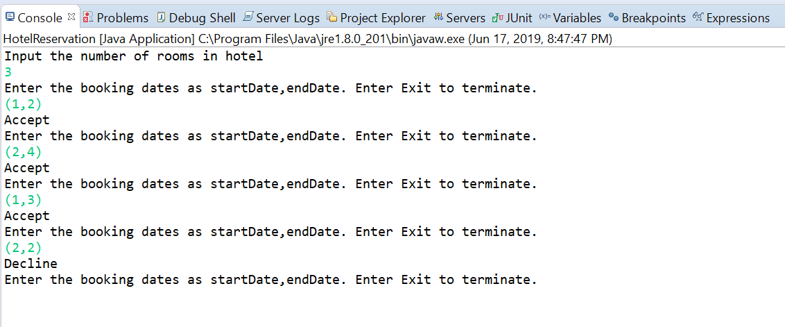
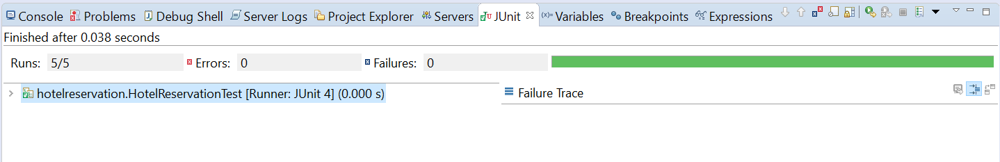

# Hotel Reservation

This is a basic implementation of Hotel Reservation Project using Java.


## Getting Started

Imagine you own a hotel with a certain number of identical rooms - let's call this number the size of your hotel. Your clients would like to make reservations for rooms: They e.g. call to check if they can make a reservation for one room from a certain start date start until a certain end date end. For each booking request you will have to check if there is a room available and either confirm the booking or reject it. 

### Prerequisites

Latest version of Java from here - https://www.oracle.com/technetwork/java/javase/downloads/index.html  
Eclipse - https://www.eclipse.org/downloads/packages/release/2019-03/r/eclipse-ide-java-developers


### Installing

Set the JAVA_HOME Path
```
set path=C:\Program Files\Java\jdk1.8.0_121\bin
```
Check whether JAVA_HOME is set or not.
```
echo $JAVA_HOME
```
## Running the Application

Run HotelReservation.java file and it will prompt for input.  
Input:   
Enter the number of rooms in a hotel.  
Enter the start date and end date for room reservation.  

Output:  
Accept/Decline - Based on the availability  



## Running the tests

Run the HotelReservationTest.java file. There are five test case scenarios mentioned below.    
Format: (Start Date, End Date) - Result(Accept/Decline)  
1a/1b: Requests outside our planning period are declined (Size=1)      
  (-4,2)  -  Decline  
  (200,400) -  Decline  
   
2: Requests are accepted (Size=3):
  (0,5)  -  Accept   
  (7,13) -  Accept   
  (3,9)  -  Accept   
  (5,7)  -  Accept   
  (6,6)  -  Accept   
  (0,4)  -  Accept   
  
3: Requests are declined (Size=3)  
StartDate EndDate Result:   
  (1,3)  -  Accept   
  (2,5)  -  Accept   
  (1,9)  -  Accept  
  (0,15) -  Decline  
  
4: Requests can be accepted after a decline (Size=3)  
StartDate EndDate Result:  
  (1,3)  -  Accept   
  (0,15) -  Accept  
  (1,9)  -  Accept   
  (2,5)  -  Decline   
  (4,9)  -  Accept  
  
5: Complex Requests (Size=2)  
StartDate EndDate Result:   
  (1,3)  -  Accept   
  (0,4)  -  Accept   
  (2,3)  -  Decline   
  (5,5)  -  Accept   
  (4,10) -  Decline   
  (10,10) - Accept  
  (6,7)  -  Accept   
  (8,10) - Accept  
  (8,9)  - Accept  
  

